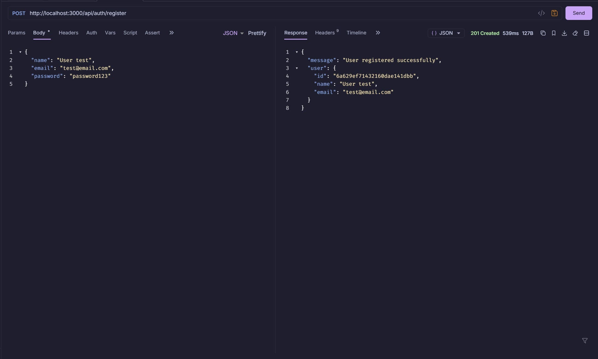
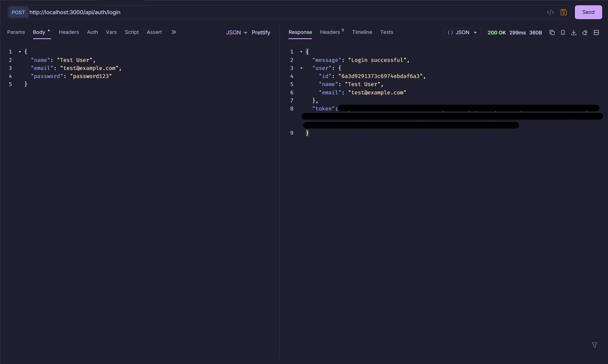
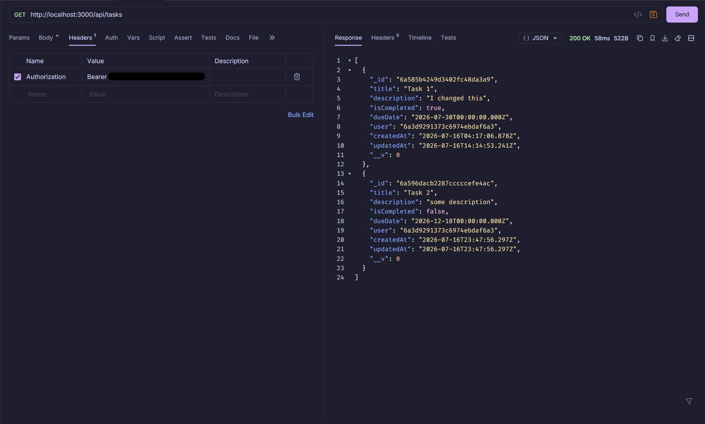
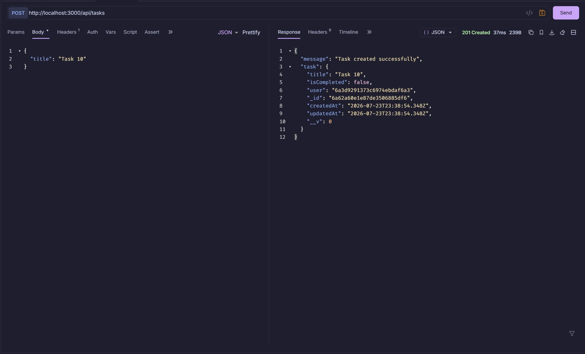
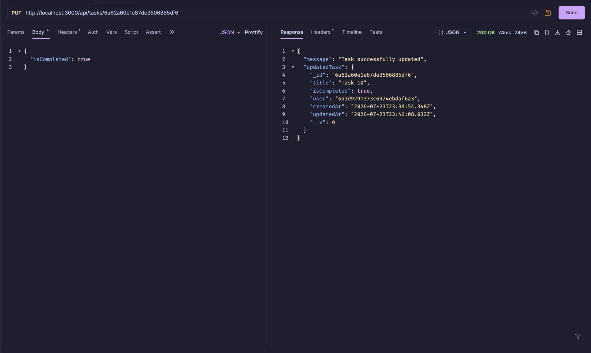
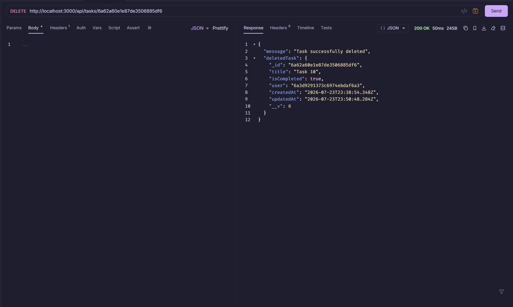
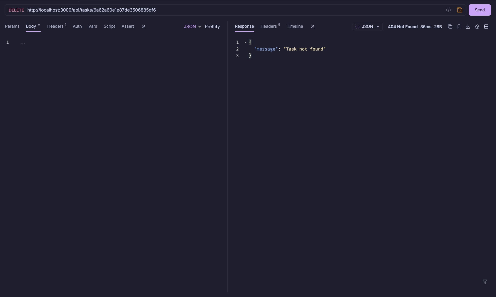

# Backend API for a Task Tracker Application

This Task Tracker API is a simple Express backend that allows users to register, log in, and manage task records with authentication and protected routes.

## Main Features

The main features of this API allow a user to:

- Register an account with a name, email, and password
- Log in and receive a JWT token
- View and manage only their own tasks
- Create, view, update, and delete tasks

Additionally, the API includes:

- Password hashing with bcrypt
- MongoDB integration with User and Task models
- Unique task titles per user
- Authentication middleware that protects the tasks routes
- Environment variables for sensitive values
- A health check route that confirms the API is running

## Technologies Used

### Development

- **[Visual Studio Code](https://code.visualstudio.com/)**
- **[ESLint](https://eslint.org/)** and **[Prettier](https://marketplace.visualstudio.com/items?itemName=esbenp.prettier-vscode)** to lint and format the code to prevent errors
- **[eslint-config-prettier](https://github.com/prettier/eslint-config-prettier)** to use ESLint and Prettier together without conflicts
- **[nodemon](https://nodemon.io/)** to automatically restart Node.js on file changes
- **[Bruno](https://www.usebruno.com/)** for testing the API

### Dependencies

- **[bcryptjs](https://www.npmjs.com/package/bcryptjs)** for password hashing and comparisons
- **[dotenv](https://www.npmjs.com/package/dotenv)** to load environment variables
- **[Express.js](https://expressjs.com/en/)** for the server and handling routes and requests
- **[CORS](https://www.npmjs.com/package/cors)** to allow a local frontend to communicate with the local backend
- **[jsonwebtoken](https://www.npmjs.com/package/jsonwebtoken)** to generate and verify JWTs
- **[MongoDB Atlas Database](https://www.mongodb.com/products/platform/atlas-database)** is a cloud application for MongoDB
- **[Mongoose](https://mongoosejs.com/)** to connect to MongoDB and handle models, validation, and queries

## Instructions for Local Setup

### Prerequisites

- A code editor such as **[Visual Studio Code](https://code.visualstudio.com/)**
- **[Node.js (LTS Version recommended)](https://nodejs.org/en)** version 24.15.0 or above installed
- **[Git](https://git-scm.com/)** to clone and manage the repository
- A MongoDB database, such as **[MongoDB Atlas Database](https://www.mongodb.com/products/platform/atlas-database)**

### Steps

#### 1. Verify Prerequisites

Verify that you have the prerequisites downloaded by using the following commands:

```bash
node -v
npm -v
git --version
```

#### 2. Clone the repository

Open your terminal and run the following commands to clone the project:

```bash
git clone https://github.com/adriarodr/task-tracker-api.git
cd task-tracker-api
```

#### 3. Install the Dependencies

Install all the required packages in the `package.json` using the following command:

```bash
npm install
```

#### 4. Create a `.env` file

Either duplicate the `.env.example` file and rename it to `.env`, or create a new `.env` file and add the required variables mentioned in [List of Required Environment Variables](#list-of-required-environment-variables).

#### 5. Start the server

Start the local server with:

```bash
npm start
```

or, if you want Node.js to automatically restart on file changes, use:

```bash
npx nodemon
```

To confirm that the API is running, visit `http://localhost:PORT/api/health` where PORT is the port number you set in `.env` or the default value 3000.

## List of Required Environment Variables

The API requires the following environment variables:

```ini
PORT=your_port_number
ORIGIN_URL=your_frontend_URL
MONGO_URI=your_mongodb_connection_string
JWT_SECRET=your_jwt_secret
```

- `PORT` is the port number the local server runs on
- `ORIGIN_URL` is your frontend's URL to use for CORS and allow the frontend to communicate with the API
- `MONGO_URI` is your MongoDB connection string
- `JWT_SECRET` is the secret key used to sign and verify JWTs

These variables are included in `.env.example`, so you can copy that file, rename it to `.env`, and add your own values.

## API Route Overview

| **Method** | **Route**          | **Description**                                | **Auth Required** |
| ---------- | ------------------ | ---------------------------------------------- | ----------------- |
| GET        | /api/health        | Confirms the API is running                    | No                |
| POST       | /api/auth/register | Allow a new user to register                   | No                |
| POST       | /api/auth/login    | Allow a user to log in and receive a JWT token | No                |
| GET        | /api/tasks         | Return all tasks for the logged-in user        | Yes               |
| GET        | /api/tasks/:id     | Return a specific task by its ID               | Yes               |
| POST       | /api/tasks         | Create a new task                              | Yes               |
| PUT        | /api/tasks/:id     | Updates an existing task                       | Yes               |
| DELETE     | /api/tasks/:id     | Deletes a task                                 | Yes               |

## How was the API Tested?

The API was tested locally using [Bruno](https://www.usebruno.com/) by sending requests to each route listed in the [API Route Overview](#api-route-overview). Both valid and invalid requests were tested to confirm that the API responds correctly.

Below are the screenshots and whether the proper API response was received for each route. Any screenshots displaying a JWT token will be redacted for security.

### Health Check

- [x] `GET /api/health` returns a 200 status code and a confirmation message


### User Registration

- [x] `POST /api/auth/register` returns a 201 status code and a confirmation message upon successful registration



- [x] `POST /api/auth/register` returns a 400 status code and an error message if user doesn't provide a name, email, and password


- [x] `POST /api/auth/register` returns a 400 status code and an error message if a user with this email already exists


### User Login

- [x] `POST /api/auth/login` returns a 200 status code and a confirmation message and JWT token upon success



- [x] `POST /api/auth/login` returns a 400 status code and error message if the user doesn't provide an email, and password


- [x] `POST /api/auth/login` returns a 401 status code and error message if the user provides the incorrect email or password


### Protected Route

- [x] `GET /api/tasks` allows access to protected routes with a valid JWT token



- [x] `GET /api/tasks` returns a 401 status code and an error message if the JWT token is invalid


- [x] `GET /api/tasks` returns a 401 status code and an error message if the JWT token is not provided


### Viewing tasks

- [x] `GET /api/tasks` returns a 200 status code and a list of the user's tasks


### Creating a task

- [x] `POST /api/tasks` returns a 201 status code and a confirmation message when task successfully created



- [x] `POST /api/tasks` returns a 400 status code and an error message if a title isn't provided


- [x] `POST /api/tasks` returns a 400 status code and an error message if the task already exists


### Updating a task

- [x] `PUT /api/tasks/:id` returns a 200 status code and a confirmation message when updating a task



- [x] `PUT /api/tasks/:id` returns a 404 status code and an error message if the task doesn't exist


### Deleting a task

- [x] `DELETE /api/tasks/:id` returns a 200 status code and a confirmation message when deleting a task



- [x] `DELETE /api/tasks/:id` returns a 404 status code and error message if the task doesn't exist



## Known Issues or Future Improvements

### Known Issues

No known issues at this time.

### Future Improvements

- Add a task category model connected to tasks, so users can organize their tasks into categories
- Add support for subtasks
- Provide more specific validation messages to tell the user which required field they're missing
- Add a GET route to return all tasks due on the current day
